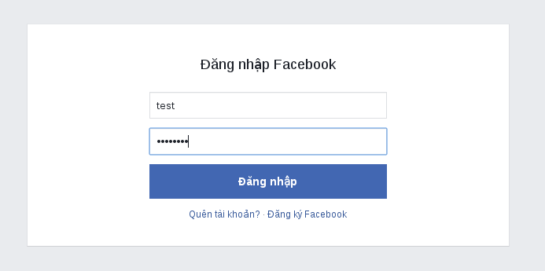
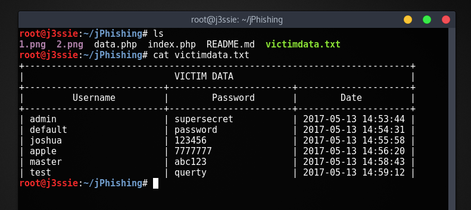

# jPhishing
Simple Phishing using PHP without database

## Installation
```
$ git clone https://github.com/j3ssie/jPhishing.git
$ cp jPhishing/* /var/www/html/
$ chmod 777 /var/www/html/victimdata.txt
$ service apache2 start
```
## Usage
* Rediect all traffic to our localhost using [Ettercap](), [MITMF](https://github.com/byt3bl33d3r/MITMf), [Xerosploit](https://github.com/LionSec/xerosploit) or you can upload this page to any host.
* When victim login to phishing page, you'll able to see what they type.
* Catch victimdata.txt to see.

## Screenshot




## Contact me
* [j3ssiej.co.nf](http://j3ssiej.co.nf)